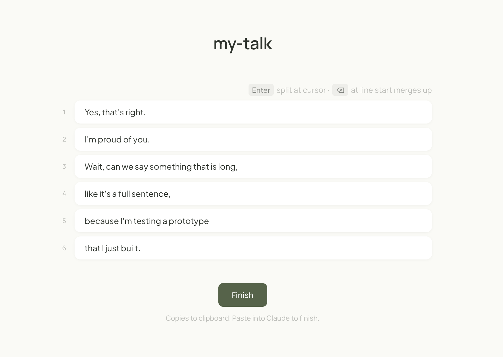

# subtitle-maker

A Claude skill that turns videos or messy auto-generated SRT files into clean, readable subtitles.

## Install

### Claude Code — recommended (terminal or IDE: VS Code, JetBrains, Cursor, Zed…)

```bash
git clone https://github.com/DianeHoo/subtitle-maker.git ~/.claude/skills/subtitle-maker
```

That's it. Say "make subtitles for `~/Downloads/my-talk.mov`" and Claude handles the rest — it'll install ffmpeg and whisper-cpp itself if you don't already have them.

### Claude.ai / Claude Desktop app

1. Download `subtitle-maker.skill` from the [Releases page](https://github.com/DianeHoo/subtitle-maker/releases).
2. Open Settings → Skills and drag it in.
3. Point Claude at your video ("make subtitles for this") — it'll walk you through any missing tools.

Works best if you've enabled Claude Desktop's local filesystem access so it can read your video and write the SRT back.

### No Claude at all

```bash
git clone https://github.com/DianeHoo/subtitle-maker.git
cd subtitle-maker
brew install ffmpeg whisper-cpp       # macOS; use your package manager elsewhere
```

Then see [Manual pipeline](#manual-pipeline).

---



*After Claude cleans up the raw transcript, you get a browser editor like this — one subtitle per card. Fix anything that still reads wrong (Enter splits at the cursor, Backspace at line start merges up), then click **Finish** to copy everything back to Claude.*

---

## Why

Auto-captions cut at pauses, not at meaning. And they're full of small errors — lowercase `i`, missing question marks, split proper nouns, homophones. This tool fixes both in one pass, with Claude doing the tedious cleanup silently.

**What makes it different:**

- **Respects the speaker's rhythm.** Keeps the original pause points as one signal alongside semantics and reading speed, instead of throwing them out.
- **Claude cleans up, not you.** An internal checklist handles capitalization, punctuation, homophones, dangling prepositions, split proper nouns. You only review the 5% that needs human judgment.
- **Edit in a browser, not a timecode file.** One card per subtitle. Enter splits, Backspace merges. Timestamps realign automatically.
- **Standard SRT out, nothing locked in.** Drop the file straight into YouTube, DaVinci, Premiere, Final Cut, ffmpeg burn-ins, translation tools — wherever you need it next.
- **Local and open source.** Runs on your machine. No cloud.

---

## Use it

Once installed, just tell Claude what you want:

> I have a video at ~/Downloads/my-talk.mov. Make YouTube captions for it.

Claude will transcribe, segment, silently self-review, and open an HTML editor in your browser. Tweak anything that reads wrong, click **Finish** (copies to clipboard), paste back into Claude. You get a clean SRT ready to upload.

## What is an SRT file and what do I do with it?

SRT is the universal subtitle format — just a plain text file with timings and text, readable in any text editor:

```
1
00:00:00,050 --> 00:00:02,840
Yes, that's right.

2
00:00:02,840 --> 00:00:05,560
I'm proud of you.
```

Once you have your `.srt`, here are the usual next steps:

- **Upload to YouTube / Vimeo as closed captions.** YouTube Studio → your video → Subtitles → Upload file. Viewers can toggle them on/off. Good for accessibility and SEO.
- **Play with subtitles in VLC or QuickTime.** Put the `.srt` in the same folder as your video with the same filename (`my-talk.mov` + `my-talk.srt`). VLC loads them automatically; QuickTime Player needs a plugin or use IINA instead.
- **Import into DaVinci Resolve, Premiere, Final Cut, iMovie.** All major editors accept SRT on a subtitle track. Usually: File → Import → pick the SRT, drop it on the timeline.
- **Burn the subtitles into the video permanently** (for TikTok, Instagram, anywhere that doesn't do closed captions): `ffmpeg -i my-talk.mov -vf subtitles=my-talk.srt output.mp4`.
- **Translate to another language.** Paste the SRT into Google Translate / DeepL / Claude — timings stay intact, only the text changes. Save as `my-talk.es.srt`, `my-talk.zh.srt`, etc.
- **Search or index your talk.** The SRT is just text, so you can grep it, feed it to an LLM ("summarize my talk"), or pipe it into transcript-search tools.

## Supported output platforms

| Target | What it does |
|---|---|
| `youtube` | Strips style tags, UTF-8, starts at `00:00:00` |
| `davinci` | Preserves `<b>` and `<font>` tags for DaVinci Resolve |
| `tiktok` / `instagram` | Shorter cues for burn-in style |
| `webvtt` | Converts to `.vtt` format for HTML5 video |
| `broadcast` | SMPTE preroll offset, frame-aware |
| `generic` | Vanilla clean SRT |

---

## How the segmentation works

At every word boundary, a cut score is computed from multiple signals:

| Signal | Weight |
|---|---|
| Previous word ends in `.?!` | forced cut |
| Previous word ends in `,;:` | +2 |
| Original ASR paused here | +2 |
| Current word is a conjunction / subordinator | +1 / +0.8 |
| Accumulated words ≥ 7 | +0.3/word |
| Would split a proper noun pair (`Silicon Valley`) | −5 (veto) |
| Would end on `the`, `of`, `a` | −2 |
| Accumulated words ≥ 10 | forced cut |

Cuts happen when the score crosses a tunable threshold. See [`reference/segmentation_algorithm.md`](reference/segmentation_algorithm.md).

## Manual pipeline

If you're running the scripts directly:

```bash
# 1. Transcribe (video → raw SRT + word timeline)
python scripts/transcribe.py input.mov --model base.en

# 2. Segment → HTML editor
python scripts/segment.py input.srt \
  --output draft.html --timeline timeline.json

# 3. Open the editor, edit, click Finish
open draft.html

# 4. Paste clipboard content into edited.txt, then:
python scripts/build_srt.py edited.txt \
  --timeline timeline.json --output final.srt

# 5. Adapt for your platform
python scripts/adapt_platform.py final.srt --target youtube
```

## Repo structure

```
subtitle-maker/
├── SKILL.md                     # Workflow Claude follows when invoked
├── scripts/
│   ├── transcribe.py            # Whisper → word-level timestamps
│   ├── segment.py               # Multi-signal re-segmentation
│   ├── build_srt.py             # Draft → SRT with time alignment
│   └── adapt_platform.py        # Platform-specific output
├── templates/
│   └── editor.html              # Browser editor template
└── reference/
    ├── self_review_checklist.md # Claude's internal quality bar
    ├── common_asr_errors.md     # Error patterns
    ├── segmentation_algorithm.md
    └── platform_specs.md
```

## License

MIT
